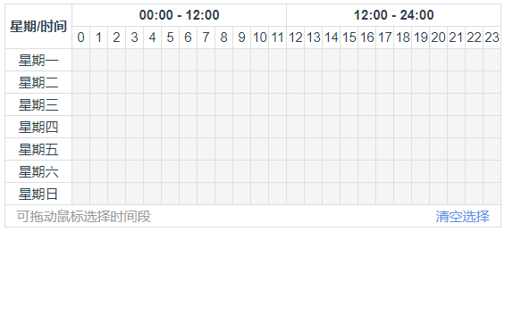
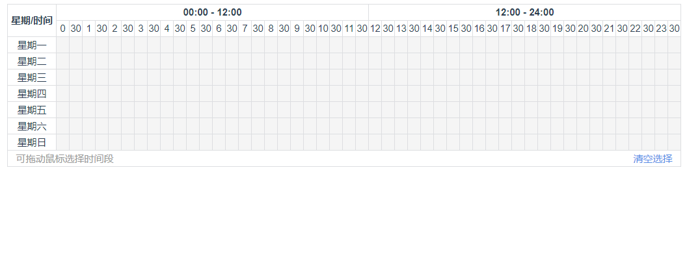

# vue-week-time-range-picker

## 用法 | usage
```html
<vue-week-time-range-picker :hasHalfHour="true" :selectedData="selectedData" @selectTimeRange="selectTimeRange" />
```

```js
import vueWeekTimeRangePicker from 'vue-week-time-range-picker'
export default {
  components: {
    vueWeekTimeRangePicker
  },
  methods: {
    selectTimeRange (checked) {
      console.log(checked)
    }
  }
}
```

## API

- hasHalfHour: true | false (默认带半小时 | default with half-hour)
- selectedData: [
    {
      iden: '3',
      mergeTimes: [['02:30', '03:00']],
      times: ['02:30'],
      week: '星期四'
    }
  ]
- selectTimeRange: 接收选中的时间 | receive selected time

## 图示

1. hour


2. half-hour
